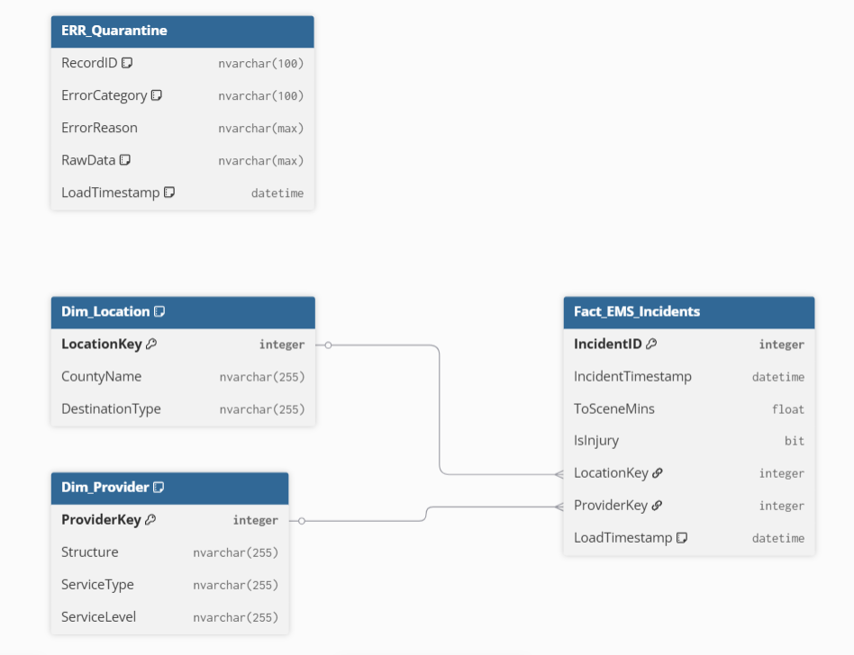

# EMS ETL Pipeline 

## Project Overview
This repository contains a production-ready, idempotent ETL pipeline designed to ingest raw Emergency Medical Services (EMS) data and transform it into a Kimball-style Star Schema. 

The pipeline acts as a **Data Quality Firewall**, enforcing strict NEMSIS standards and business logic before data reaches the analytical layer. In the current production cycle, the system processed **88,256 records**, successfully identifying and quarantining **32 invalid records** to ensure the total integrity of the Fact table.

## Architecture & Flow
The pipeline follows a modular Extract-Transform-Load (ETL) architecture:
1. **Extract**: Ingests raw NEMSIS-compliant CSV data using Pandas with automated schema inference. The extractor supports **chunk-based processing** to efficiently handle large files and applies an **incremental filter** using a high-water mark strategy to process only new records.
2. **Transform**: Executes a "Defensive Programming" multi-stage validation gate to categorize and filter records while handling NEMSIS-specific null strings.
3. **Load (Staging)**: Bulk-loads valid records into a volatile `STG_EMS_INCIDENTS` table using SQLAlchemy, leveraging batch-oriented processing for scalability.
4. **Load (Warehouse)**: 
    * **Dimension Sync**: Performs atomic T-SQL `MERGE` operations to maintain uniqueness in `Dim_Location` and `Dim_Provider`.
    * **Fact Load**: Inserts the final **88,224 valid records** into the Star Schema using set-based `MERGE` operations optimized with indexing strategies for high-performance joins.
    * **Audit Load**: Uses a specialized `pyodbc` cursor with expanded buffers to handle `NVARCHAR(MAX)` JSON blobs for quarantined data.

## Model Grain & Definitions
The warehouse utilizes a Kimball Star Schema designed for high-performance BI analytics.

### Fact Table
* **Fact_EMS_Incidents**: The grain is one record per EMS Incident `IncidentID`. 
* **Measures**: `ToSceneMins` (Response Time), `ToDestinationMins` (Transport Time).
* **Keys**: Foreign keys to `Dim_Location` and `Dim_Provider`.

### Dimensions
* **Dim_Location**: SCD Type 1 dimension. Attributes: `CountyName`, `DestinationType`.
* **Dim_Provider**: SCD Type 1 dimension. Attributes: `Structure`, `ServiceType`, `ServiceLevel`.

### Performance Optimization
To support scalable analytical workloads, indexing strategies are applied:
* Clustered index on `Fact_EMS_Incidents (IncidentID)`
* Non-clustered indexes on foreign keys (`LocationKey`, `ProviderKey`)
* Composite indexes on dimension attributes used in joins

## Data Quality Summary
The pipeline categorizes the **32 rejections** into three specific business-driven buckets identified during the current run. This represents a **99.96% data health rate** for the 88,256 records processed.

| Category | Rejection Logic | Records Rejected |
| :--- | :--- | :--- |
| **Duration Outlier/Negative** | Response times < 0 mins or > 1440 mins (24h). | 25 |
| **Missing Critical Info** | Nulls in `_id`, `INCIDENT_DT`, or `INCIDENT_COUNTY`. | 6 |
| **Invalid Timestamp Sequence** | Chronological violations (e.g., Arrived < Dispatched). | 1 |
| **Duplicate/Schema Error** | Duplicate `_id` values or missing required columns. | 0 |

## Logging & Error Handling
* **Automated Table Truncation**: The `ERR_Quarantine` table is automatically truncated at the start of each load cycle to prevent "cumulative append noise."
* **Auditability**: Quarantined records are moved to `ERR_Quarantine`. We use a JSON Serialization pattern to preserve the full raw record alongside a `QuarantineReason` for medical auditors.
* **Logging**: A dedicated Python `logging` module tracks the ETL lifecycle, row counts, execution time, and incremental load behavior for performance monitoring.

## Automated Testing
The system includes a robust test suite to prevent regression:
1. **Unit Tests**: Validates `EmsTransformer` logic using `pytest` to ensure all 4 rejection categories are caught.
2. **Integration Tests**: Verifies that the `MERGE` logic correctly handles "Unknown" members and avoids duplicates.
3. **Command**: Run `python -m pytest` to execute the full validation suite.

## Incremental Strategy & Idempotency
1. **Idempotency**: The use of T-SQL `MERGE` ensures that if a file is re-processed, records are updated rather than duplicated.
2. **High-Water Mark**: The pipeline implements a metadata-driven incremental load strategy using an `ETL_Metadata` table. The Python Extract layer filters records based on the last successful run timestamp, ensuring only new data is processed.

## Assumptions & Decisions
* **NEMSIS Nulls**: Values like "Not Recorded" or "Not Applicable" are coerced to true SQL `NULLs`. This ensures that averages are not skewed by placeholder text.
* **Surrogate Keys**: `IDENTITY` columns are used for dimensions to decouple the warehouse from source system changes.
* **Negative Durations**: These are treated as "Entry Errors" and quarantined rather than being "fixed," as altering medical timestamps without an audit trail is a compliance risk.

## How to Run End-to-End
1. **Initialize DB**: Run `sql/ddl.sql` in SQL Server to create the schema.
2. **Configuration**: Set your connection string in `config/config.yaml`.
3. **Data**: Place the EMS CSV in the `data/` folder.
4. **Execute**: Run `python main.py`.